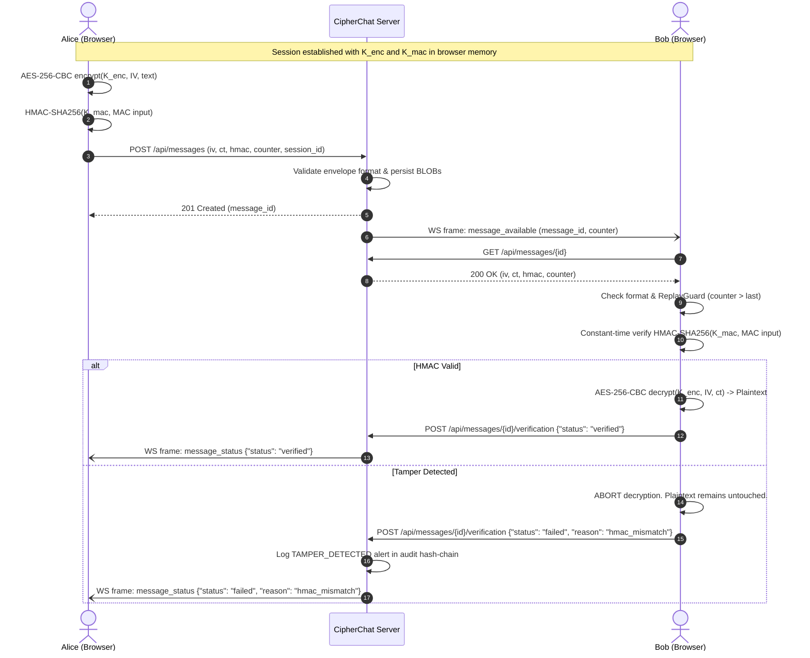

# CipherChat (Phase 5)

Secure two-user chat over a LAN featuring in-browser Diffie-Hellman key exchange, HKDF key derivation, mutual key confirmation, session lifecycle management, and **end-to-end encrypted messaging with AES-256-CBC + HMAC-SHA256 (Encrypt-then-MAC)** over a blind server relay architecture.

> [!NOTE]
> **Zero Knowledge & Blind Server Relay:**
> Plaintext never leaves the sender's browser, and session keys ($K_{enc}, K_{mac}$) never touch the server or leave memory. The server acts purely as an untrusted blind relay, validating envelope structure and relaying base64 payloads without the ability to inspect or tamper with plaintext.

---

## Core Principles

1. **Blind Server Relay:** The server never has $K_{enc}$ or $K_{mac}$, never computes or verifies HMACs, and never decrypts ciphertexts. Enforced by design and verified by automated source-grep tests.
2. **Zero Plaintext Persistence:** Plaintext never touches server disk (`app.db`), server logs, or WebSocket frames.
3. **Encrypt-then-MAC with Strict Verification Order:**
   $$\text{Format Validation} \longrightarrow \text{Replay Guard Check} \longrightarrow \text{HMAC Verification} \longrightarrow \text{AES Decryption + PKCS\#7 Unpad}$$
   If format, replay counter, or HMAC tag verification fails, **ciphertext is NEVER decrypted**.
4. **Replay Protection:** Per direction, per session counters enforce $\text{counter} > \text{last\_accepted}$. Decrements, duplicates, and replays are rejected.

---

## Cryptographic Specification

### Session Key Establishment (Phase 3)
| Component | Specification |
| :--- | :--- |
| **DH Group** | RFC 3526 Group 14 (2048-bit MODP safe prime), generator $g = 2$ |
| **Private Exponent** | 32 random bytes from CSPRNG (`crypto.getRandomValues` / `secrets.token_bytes`), top bit forced to 1 ($x \ge 2^{255}$) |
| **Public Wire Format** | 512 lowercase hex characters (fixed 256-byte big-endian encoding, zero-padded) |
| **Public Key Validation** | $2 \le y \le P - 2$; non-hex or wrong-length inputs rejected with `bad_public` |
| **Shared Secret** | $Z = \text{peer\_y}^x \pmod P$, encoded as 256-byte big-endian |
| **HKDF** | RFC 5869 HKDF-SHA256 |
| **HKDF Salt** | $\text{SHA-256}(\text{"CC1-salt"} \parallel \text{session\_id} \parallel \text{pub\_initiator} \parallel \text{pub\_responder})$ |
| **Derived Keys** | $K_{enc}$ (32B with `"CipherChat v1 enc"`), $K_{mac}$ (32B with `"CipherChat v1 mac"`), Fingerprint (8B with `"CipherChat v1 fingerprint"`) |
| **Fingerprint Format** | 4 groups of 4 uppercase hex characters separated by spaces (e.g. `60B3 9698 05E7 205C`) |
| **Confirmation Tag** | $\text{HMAC-SHA256}(K_{mac}, \text{"CC1-confirm"} \parallel \text{session\_id} \parallel \text{role\_char})$, verified in constant time |

### End-to-End Encrypted Messages (Phases 4–5)
| Component | Specification |
| :--- | :--- |
| **Cipher** | AES-256-CBC with PKCS#7 padding |
| **Encryption Key** | $K_{enc}$ (32 bytes derived via HKDF) |
| **IV** | Fresh random 16 bytes per message from CSPRNG (`crypto.getRandomValues` / `os.urandom`) |
| **Counter** | 64-bit unsigned big-endian integer, strictly monotonically increasing per sender direction |
| **Message Type** | `"text"` (1–2000 characters, $\le 8000$ UTF-8 bytes) or `"image"` (RGB pixel buffer, max 512×512) |
| **Metadata** | Deterministic JSON string `"{}"` |
| **Canonical MAC Input** | ASCII `"CC1-msg"` followed by 4-byte big-endian lengths and values: `session_id`, `sender_role` (`"I"` or `"R"`), `counter` (8 bytes), `msg_type`, `meta_json`, `iv` (16 bytes), `ciphertext` |
| **Integrity Tag** | $\text{HMAC-SHA256}(K_{mac}, \text{MAC input})$ (32 bytes, constant-time compared) |
| **Replay Protection** | ReplayGuard ensures $\text{counter} > \text{last}$; resets on session termination |
| **Failure Reasons** | `"bad_format"`, `"replay"`, `"hmac_mismatch"`, `"decrypt_error"` |

## Images (Phase 5)

Images use the same session keys, AES-256-CBC + HMAC-SHA256 envelope, per-direction counter, replay guard, and verification-before-decryption flow as text. The browser decodes PNG, JPEG, WebP, or the first GIF frame, scales it to at most 512×512 without upscaling, flattens transparency onto white, then encrypts the raw row-major RGB bytes (8 bits per channel). File-format bytes such as PNG or JPEG are never sent.

The authenticated cleartext metadata is the exact compact string `{"w":W,"h":H}`. The ciphertext length must be `((w*h*3 // 16)+1)*16`, including a full padding block when needed. Both dimensions are limited to 1–512; the maximum plaintext is 786,432 bytes and ciphertext 786,448 bytes. Dimensions and ciphertext length remain visible to the server and on the wire; the MAC authenticates metadata but does not encrypt it. Stored image messages are the envelope fields (IV, ciphertext, HMAC) as BLOBs, with dimensions in metadata.

The UI can display the first `w*h*3` ciphertext bytes as a noise image for demonstration. That view is derived locally and is not transmitted separately. Image receive handling still checks structure, replay counter, and HMAC before decrypting, then checks strict metadata syntax, dimensions, and decoded pixel length.

---

## Architecture Overview

```
CipherChat/
├── backend/                  FastAPI + WebSocket server (SQLAlchemy 2.0 + SQLite)
│   ├── app/
│   │   ├── config.py         Config, DB_PATH, JWT settings, tamper demo flag
│   │   ├── deps.py           Auth dependencies (get_current_user, require_role)
│   │   ├── main.py           FastAPI app, lifespan DB init, router registration
│   │   ├── crypto/           Reference crypto & verification (server never uses keys in live paths)
│   │   │   ├── params.py     RFC 3526 Group 14 parameters
│   │   │   ├── dh.py         Public key validation & DH reference operations
│   │   │   ├── kdf.py        HKDF-SHA256 key derivation & confirmation reference
│   │   │   └── envelope.py   AES-256-CBC + HMAC-SHA256 reference and NIST SP 800-38A tests
│   │   ├── db/
│   │   │   ├── base.py       SQLAlchemy engine, WAL PRAGMA, SessionLocal, init_db
│   │   │   └── models.py     User, AuthSession, AuditLog, ChatSession, Message models
│   │   ├── routers/
│   │   │   ├── auth.py       /api/auth (register, login, logout, me)
│   │   │   ├── admin.py      /api/admin/tamper (analyst tamper simulation toggle)
│   │   │   ├── messages.py   /api/messages (POST send, GET fetch, POST verification)
│   │   │   ├── health.py     /api/health
│   │   │   └── ws.py         /ws (WebSocket relay for handshake & message availability)
│   │   ├── services/         Audit logging with SHA-256 hash chaining & tamper service
│   │   ├── tests/            Pytest test suites (auth, crypto, session lifecycle, envelope, messages API)
│   │   └── ws/               ConnectionManager & session coordinator
│   └── data/                 SQLite database (app.db) and generated jwt_secret
├── frontend/                 Vite + React 19 + TypeScript SPA
│   └── src/
│       ├── api/              HTTP client (http.ts) with Bearer token & 401 handler
│       ├── auth/             AuthContext & sessionStorage manager
│       ├── chat/             Chat types & messageService (serial processing queue, send/verify)
│       ├── components/       ServerAddressInput
│       ├── crypto/           In-browser cryptographic implementation
│       │   ├── params.ts     RFC 3526 Group 14 constants & byte lengths
│       │   ├── encoding.ts   Strict hex/byte/bigint conversions
│       │   ├── base64.ts     Strict Base64 byte conversions
│       │   ├── modpow.ts     Square-and-multiply BigInt modular exponentiation
│       │   ├── dh.ts         Browser DH key generation & shared secret computation
│       │   ├── kdf.ts        HKDF derivation, fingerprinting, confirmation tags
│       │   ├── envelope.ts   AES-256-CBC + HMAC-SHA256 encryption, canonical MAC, decryption
│       │   ├── replayGuard.ts Monotonic counter tracking per sender role
│       │   ├── sessionKeys.ts Ephemeral in-memory key storage with zeroing
│       │   ├── handshake.ts  HandshakeRunner client-side state machine
│       │   └── __tests__/    Vitest test suites verifying envelope & shared vectors
│       ├── pages/            AuthPage, ChatPage (with Wire View), AnalystPage (with Tamper Panel)
│       └── ws/               ChatSocket (v1 protocol with DH & message notifications)
└── shared/
    └── test_vectors/
        ├── dh_hkdf.json      Deterministic cross-language DH & HKDF test vectors
        └── envelope.json     Deterministic cross-language message envelope test vectors
```

---

## Message Relay Flow



---

## Running the Application

### 1. Backend Setup

From the repository root:

```powershell
.\.venv\Scripts\Activate.ps1
uvicorn app.main:app --app-dir backend --host 0.0.0.0 --port 8000
```

### 2. Frontend Setup

From `frontend/`:

```powershell
npm install
npm run dev
```

To build production assets served directly by FastAPI:
```powershell
npm run build
```

---

## Running Automated Tests

### Backend Tests (pytest)
Runs auth, crypto DH/KDF, envelope tests, blind-relay source grep, and REST API messages test suite:
```powershell
.venv\Scripts\python.exe -m pytest backend/app/tests -v
```
Backend tests cover authentication, crypto, encrypted text and image envelope vectors, relay behavior, and REST verification flows.

### Frontend Tests (vitest)
Runs in-browser cryptographic unit tests, NIST SP 800-38A F.2.5 KAT, replay guards, and cross-language vector validation:
```powershell
cd frontend
npm test
```
Frontend tests cover browser crypto, shared cross-language vectors, replay guards, and image pixel processing.

### Image acceptance checks

- Send JPEG, transparent PNG, large downscaled photo, 1×1 image, and GIF first frame; compare sender and receiver pixel hashes.
- Confirm text and images share a continuous counter and the analyst tamper simulation rejects a modified image before decryption.
- Confirm image database rows contain only encrypted envelope bytes, dimensions are visible metadata, and image URLs/buffers are cleared with session state.

---

## Live Tamper Simulation (Demo Walkthrough)

To demonstrate the Encrypt-then-MAC integrity guarantee:

1. **Sign in as Users:** In two browser windows (e.g. Chrome and Firefox), sign in as `alice` and `bob`. Both pair up and complete the DH key exchange to establish a secure session.
2. **Sign in as Analyst:** In an Incognito window, sign in as an analyst (e.g. `analyst1`).
3. **Arm Tamper:** In the Analyst Portal, locate the **Tamper Simulation** panel and click **"Arm tamper for the next message"**.
4. **Send Message:** In Alice's window, type and send a secret message: `"Classified project coordinates"`.
5. **Observe Verification Failure:**
   - The server flips 1 bit in the ciphertext during transit.
   - Bob's browser receives the envelope and evaluates the HMAC **before** attempting decryption.
   - The tag does not match: Bob's browser displays a red warning badge:  
     `⚠️ [message could not be verified, not decrypted]`  
     with status `⚠️ Integrity FAILED (hmac_mismatch)`.
   - Alice's bubble updates to `✗ Integrity failed at peer (hmac_mismatch)`.
   - A `TAMPER_DETECTED` alert is permanently committed to the server's SHA-256 audit hash-chain.
   - Inspecting the **Wire view (demo only)** collapsible drawer on both sides reveals the raw counter, IV, truncated ciphertext, HMAC, and verification status.

## Security Dashboard (Phase 6)

The analyst dashboard is a REST-polled, read-only view of metadata already stored in `app.db`. It provides a summary strip, audit Events, message metadata, session history, audit-chain verification, and the Phase 4 tamper controls. Crypto Lab and Network Analysis are placeholders for later phases.

Seed an analyst account from the backend directory, then sign in through the normal page:

```powershell
cd backend
..\.venv\Scripts\python.exe -m app.scripts.seed_analyst --username analyst1
```

Use a separate browser tab or profile for each account. Authentication uses `sessionStorage`, which is isolated per tab. The seed script prompts for the analyst password and confirms the created username.

| Endpoint | Dashboard data |
| --- | --- |
| `GET /api/dashboard/summary` | Online usernames, active session, message/session totals, selected security counts, audit row count |
| `GET /api/dashboard/logs` | Filterable, newest-first audit events with paging |
| `GET /api/dashboard/logs/types` | Event categories and severity values |
| `GET /api/dashboard/messages` | Message metadata, sizes, image dimensions, and verification status |
| `GET /api/dashboard/sessions` | Session lifecycle, duration, handshake time, matching fingerprint, message counts |
| `GET /api/dashboard/audit-integrity` | Full audit hash-chain verification result |

Every dashboard endpoint requires the analyst role. Reads do not append audit rows. The dashboard follows the blind-relay rule: it shows metadata needed for monitoring, but never password hashes, JWTs or token `jti` values, DH public values, ciphertext, IVs, HMAC blobs, keys, plaintext, or decrypted images. Image dimensions, message sizes, timestamps, participants, status and the agreed fingerprint are visible metadata; message contents and keys remain in the users' browsers.

Audit event categories are defined by the backend and served through `/api/dashboard/logs/types`: **auth**, **session**, **message**, **demo**, and **lab**. Events outside those sets are categorized as **other**. Severity filters support info, warning, and alert.

### Phase 6 acceptance checks

Automated checks:

```powershell
.venv\Scripts\python.exe -m pytest backend/app/tests -v
cd frontend
npm test
```

Manual walkthrough:

1. Sign in as analyst in one tab and as Alice and Bob in two others. Confirm online users, established-session fingerprint, and message counts update within about five seconds.
2. Make a bad Alice login and confirm the Unauthorized access attempt alert appears within about three seconds. After five failed attempts, confirm the account-lock event. Security alerts only filters warning and alert events.
3. Send text and images and check type, participants, size, image dimensions, and verification status in Messages. Arm tamper in Demo Controls and send another message; its failed integrity state and tamper alert should appear.
4. Check session handshake time, duration, and end reason. Logging Alice out should create Session ended (logout). Selecting a session opens its filtered Events.
5. Exercise the Events filters and Load older paging. Pause Live, then resume and confirm new events arrive without duplicates.
6. Verify the audit chain, then edit an audit row in a disposable local database and verify that the dashboard reports the damaged row.
7. Confirm dashboard requests return 401 without a token and 403 with a normal user token, and inspect responses to confirm they contain metadata only.
8. Confirm the Crypto Lab and Network tabs show their later-phase placeholders and Demo Controls still arms and disarms tamper.

## Security Metrics (Text) — Phase 7

Text-security experiments run only in the sending browser after the encrypted message is accepted. The sender reuses the message IV for its local trials, but plaintext, keys, IVs, trial ciphertexts, and decrypted content never enter the metrics request. The `/api/lab/text-metrics` body contains a message/session identifier and numeric lengths, trial observations, percentages, and timings. The server validates ranges and ownership, then stores those client-reported numbers in the separate `backend/data/lab.db`; it does not calculate metrics or aggregates. Analysts' averages and regression fits are computed in the dashboard browser.

| Measurement | Browser experiment | Reported result |
| --- | --- | --- |
| Confusion | Flip one random bit in a copy of the AES key for each of 8 trials | Changed ciphertext bits as a percentage; expected near 50% |
| Diffusion / avalanche | Flip one random plaintext bit for each of 8 trials; compare the whole ciphertext and the corresponding 16-byte block | Mean changed bits, whole-message percentage, and block percentage |
| AES timing | Warm up, calibrate a batch to at least 5 ms, then take 5 batches; decryption is checked against the original bytes | Median encryption/decryption microseconds per operation and encryption batch size |

The baseline first re-encrypts the original bytes and aborts if they do not reproduce the message ciphertext. CBC propagation means a changed plaintext block affects that block and later ciphertext blocks, while earlier blocks remain unchanged. Therefore block avalanche is expected around 50%; whole-message avalanche is around 50% for one-block messages and trends lower (roughly 25–35% for long messages) as random bit flips affect a smaller suffix on average. These are expectations, not server-verified guarantees.

The chat composer has **Collect security metrics (sends numeric results only, never message content)** enabled by default and persisted per browser. Turn it off for clean Wireshark captures. The serial background job yields between trials, caps its queue, retries a transient server/network error once, and is aborted when the session keys are cleared. Only the sender posts metrics; receivers do not.

Metrics are client-reported and cannot be verified by the server. The dashboard shows reported statistics only. Limitations include browser timer resolution and scheduling noise; the derived exact plaintext byte length leaks a small amount of information; and client-reported observations may be inaccurate or fabricated.

### Phase 7 test commands and acceptance checks

```powershell
.venv\Scripts\python.exe -m pytest backend/app/tests backend/tests -v
cd frontend
npm test
npm run build
```

The Python oracle generator is test-only and regenerates the committed cross-language vector file:

```powershell
cd backend
..\.venv\Scripts\python.exe -m tests.tools.make_text_metric_vectors
```

Acceptance walkthrough:

1. With Alice and Bob in a secure chat and Alice's collection switch enabled, send 15–20 text messages from one character to about 2000 characters, including Unicode and emoji. Confirm Bob's verification and display behavior is unchanged, Alice's wire view shows each metric job reaching `recorded`, and Text Lab records increase.
2. Check confusion values cluster near 50% with a nearly flat fit. Check block avalanche is near 50%, while whole-message avalanche is near 50% for short messages and tends lower for longer messages. Confirm encryption and decryption charts plot individual timings.
3. Turn collection off and send a message: chat works and no metric status or lab row is added. Turn it back on to resume collection. Inspect a metrics request and verify it contains numeric values and the session ID only; search the separate lab database for a distinctive plaintext and confirm it is absent.
4. Confirm Bob cannot submit metrics for Alice's message, duplicate submissions return 409, and extra or malformed fields are rejected. Check `METRICS_REJECTED` audit entries and verify the audit chain.
5. Log Alice out during analysis and confirm queued jobs stop without posting stale-key results. Clear Text Lab data and confirm the charts and rows empty, the `LAB_DATA_CLEARED` event is recorded, and subsequent sends add new rows.
6. Re-run all earlier phase acceptance checks for handshake, encrypted text and image chat, tamper simulation, and dashboard logs.

## Security metrics (Images) — Phase 8

Image security experiments run locally in the sender's browser after the encrypted image message is stored. The browser uses the exact RGB bytes, AES key, IV, and ciphertext for its baseline check and experiments. None of those inputs, nor modified ciphertexts or decrypted pixels, are included in the metrics request. `POST /api/lab/image-metrics` accepts only a session UUID and strict numeric values/nulls; the server checks ownership, stored image dimensions and ciphertext length, ranges, and consistency, then stores the client-reported values in `backend/data/lab.db`. The server performs no image metric calculations, averages, or regression fits. Only the sender reports; the receiving pipeline is unchanged. Reports are client-reported and cannot be verified by the server.

| Metric | Browser calculation |
| --- | --- |
| NPCR | Mean percentage of ciphertext-image byte positions changed after flipping one random plaintext RGB byte's least-significant bit in five trials. |
| UACI | Mean normalized absolute ciphertext byte intensity change for those same trials. |
| Entropy | Shannon entropy per RGB channel of the first `width × height × 3` ciphertext bytes. |
| Horizontal correlation | Pearson correlation across every adjacent horizontal pixel pair per channel, for plaintext and cipher image. |
| MSE / PSNR | Original vs local decrypted pixels and original vs cipher-image bytes; PSNR is null (infinite) when MSE is zero. |
| AES timing | Median calibrated browser JavaScript AES-CBC encrypt/decrypt time; no network or image decoding time. |

The baseline re-encryption must exactly match the sent ciphertext or the job aborts. CBC changes a ciphertext block and the suffix after it, while leaving preceding blocks unchanged. Random byte flips therefore average approximately **50% NPCR** and **16.7% UACI**, below the ideal random-cipher references of **99.61%** and **33.46%**. Expected cipher entropy is about `8 - 184/n` bits/channel for `n` pixels; cipher correlation approaches zero while natural-photo plaintext correlation is often high. Correct local decryption yields MSE 0 and infinite PSNR. Natural images commonly produce encrypted-image MSE around 8,000–12,000 and PSNR around 7–10 dB; these are observations, not validation requirements.

The analyst Image Lab computes aggregate values and regressions in the browser. Its encrypted thumbnails and lightbox are generated only from `GET /api/dashboard/lab/image/{message_id}/cipher-noise`, which returns exactly the first `width × height × 3` ciphertext bytes as the noise RGB image. This is the only image-dashboard endpoint that returns ciphertext-derived bytes; records, summaries, and metrics posts contain no ciphertext, IV, HMAC, or keys. Analysts cannot access original or decrypted images by design. The metrics remain client-reported and may be inaccurate or fabricated. Limitations: images are capped at 512 pixels per dimension; dimensions and sizes are visible; derived plaintext statistics such as horizontal correlation leak limited information; browser timer resolution and scheduling affect timing results; and analyst views intentionally exclude original images.

### Phase 8 tests

```powershell
.venv\Scripts\python.exe -m pytest backend/app/tests backend/tests -v
cd frontend
npm test
npm run build
```

Regenerate the deterministic cross-language image test vectors with:

```powershell
cd backend
..\.venv\Scripts\python.exe -m tests.tools.make_image_metric_vectors
```

### Phase 8 acceptance checks

1. All pytest and Vitest suites pass, including the Python/TypeScript `image_metrics.json` vectors.
2. Alice and Bob establish a chat. Alice sends about 10 photos and simple graphics at varied sizes up to 512 px. Each enabled image report reaches `recorded`; Bob's verification and pixel hash behavior remains unchanged.
3. Image Lab thumbnails show colored encrypted noise, and the lightbox shows the full noise at the recorded dimensions. No original or decrypted image is available to the analyst.
4. NPCR/UACI show individual points, average and dashed ideal reference lines, means around 40–60% and 13–21%, and an approximately flat fit over a sufficiently varied sample.
5. Cipher entropy is near 8 for large images and lower for small images, with the `8 - 184/n` reference shown.
6. Plaintext correlations are high for natural photos; cipher correlations are near zero for larger images; 1-pixel-wide images show `n/a`.
7. Correct local decryptions have zero MSE and show `∞ (identical)`; encrypted-image MSE/PSNR are displayed, with no lossless-failure rows for the correct pipeline.
8. Performance charts show individual encryption and decryption timings against pixel count.
9. Disabling collection leaves image sending functional but adds no metrics; enabling it resumes reporting. Metrics request bodies contain only numbers/nulls and the session UUID; distinctive source pixels are absent from `lab.db`.
10. A recipient cannot post metrics for the sender's image (403); duplicates return 409; extra fields are rejected; mismatched dimensions return `dimension_mismatch`; rejected attempts are audited and audit-chain verification succeeds.
11. Logging out immediately after a large image send leaves no stale queued metrics post, error spam, or retained job buffers.
12. Clearing Image Lab data empties its rows/charts and writes the `LAB_DATA_CLEARED` audit event. New image reports work afterward; Text Lab and all prior phase acceptance checks still pass.
